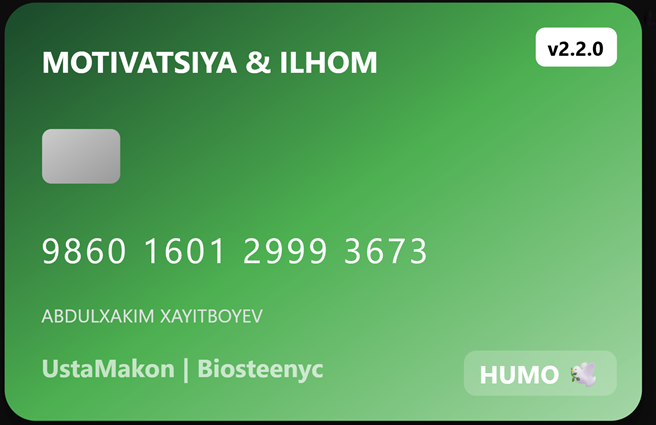

  

**Ustamakon** - mobil ilovadan turib desktop ilovaga soʻrov yuborish orqali bir bosishda tizim muammolari keshlar tozalashlar hullas optimizatsiya va diagnostikaga qiladigan ilova. Ilovani ishlatish uchun Desktop va Mobil versiyani oʻrnatib olishinggiz kerak.

**_Mobil versiyada_**
Google Play Marketdan yoki apk faylni githubdan yuklab oling va oʻrnating.
Tilni tanlang
QR kod skanerlash tugmasini bosing
Kompyuterdagi desktop ilovada chiqqan QR kodni skanerlang ulanadi
Xizmatlar oynasidan xizmatni topib pultga yuklash tugmasini bosing.
Ishga tushirish tugmasini bosing tamom.

_**Desktop versiyada**_
Windows:

- Windows tugmasini bosib UstaMakon.zip faylni yuklang.
- Zipdan chiqaring va UstaMakon.exe faylga bosing.
- Smart Screen bloklasa: "More info" -> "Run anyway" bosing.
- [ILOVANI ZARARLI TOMONI YOʻQ, VIRUS EMAS. SHUNCHAKI PULLIK MICROSOFT HISOBIM YOʻQLIGI UCHUN SERTIFIKATLAY OLMADIM. SMART SCREEN SERTIFIKATI YOʻQ BEMALOL ISHLATAVERING].

Linux:
AppImage faylni yuklab oling. 
terminalda qiling:
`cd; cd Downloads; chmod +x UstaMakon.AppImage`
yoki Fayl menejerida
 Xususiyatlardan "Dastur Sifatida ishlatish"ni yoqing.
 Endi bemalol appimage faylni fayldab ochib dasturni ishlatishiz mumkin

  
  

  
  

  
  

  
  

### 👨‍💻 Motivatsiya va Ilhom bering:
[▶️ Dasturlash rivoji uchun]

